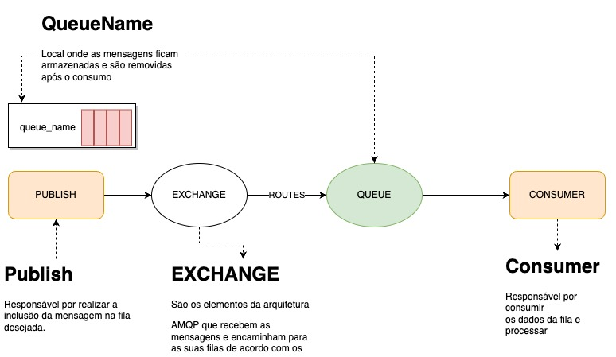

# amqp-messages

RabbitMQ é um servidor de mensageria de código aberto (open source) desenvolvido em Erlang, implementado para suportar mensagens em um protocolo denominado Advanced Message Queuing Protocol (AMQP).

## Fluxo de Mensagens


## Installation

Docker para instalar o RabbitMQ:

```
docker run -it --rm --name rabbitmq -p 5672:5672 -p 15672:15672 rabbitmq:3.10-management
```

Acessar a plataforma em http://localhost:15672/

## Curl Para Teste

```
curl --location --request POST 'http://localhost:8081/send' \
--header 'Content-Type: application/json' \
--data-raw '{
    "text":"Message Send to Rabbit"
}'
```

## Teste

1. Executar a Aplicação Producer na porta selecionada.
   1. Se desejar enviar as requisições nesta etapa, você irá perceber que as mensagens ficaram armazenadas na fila criada, aguardando o consumer para processar.
2. Executar a Aplicação Consumer na porta selecionada.
   1. Se já existir mensagens na fila, as mensagens serão processadas e sempre que chegar nova mensagem.

